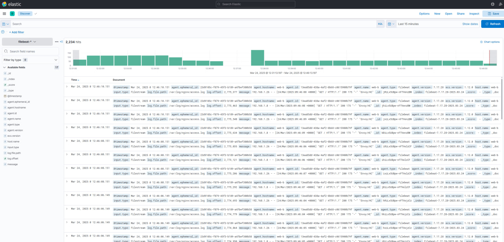
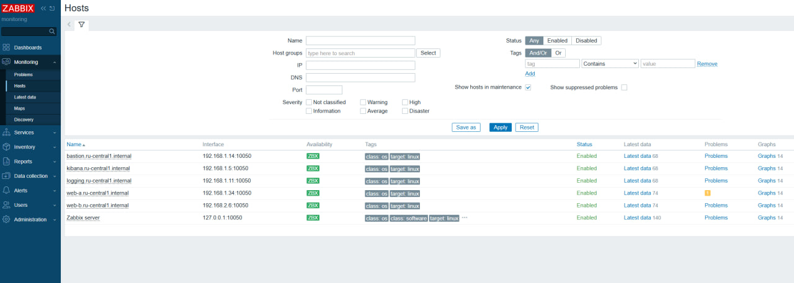
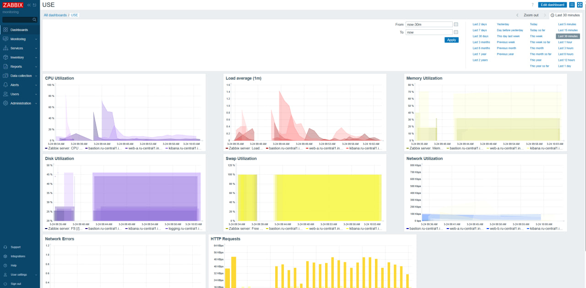
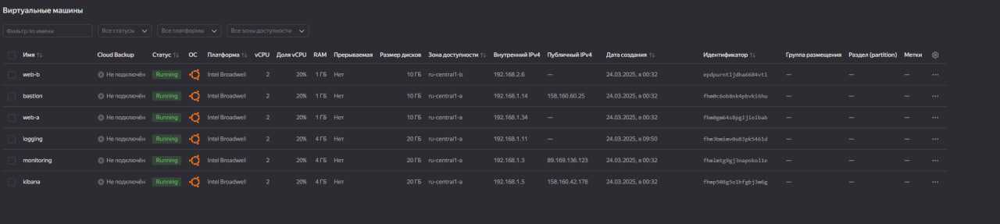

# Дипломное задание: Отказоустойчивая инфраструктура в Yandex Cloud

## Описание

Проект разворачивает отказоустойчивую инфраструктуру в Yandex Cloud с использованием Terraform и Ansible.  
Система включает балансировку нагрузки, мониторинг, сбор логов и резервное копирование.

## Архитектура

- Bastion-хост (`bastion`) — внешний доступ по SSH, IP: 158.160.60.25
- Два веб-сервера (`web-a`, `web-b`) в разных зонах, за балансировщиком http://84.201.148.203/
- Сервер логирования (`logging`) с Elasticsearch
- Сервер мониторинга (`monitoring`) с Zabbix http://89.169.136.123/zabbix
- Kibana на отдельной ВМ (`kibana`)  http://158.160.42.178:5601

## Код

Репозиторий содержит:

- Terraform: создание инфраструктуры в Yandex Cloud
- Ansible: автоматизация установки ПО

## Скриншоты

### Интерфейс Kibana

### Интерфейс Zabbix – хосты

### Интерфейс Zabbix – графики

### Виртуальные машины в Yandex Cloud

## Решения и компромиссы

- Репозитории Elastic и Zabbix недоступны из РФ — созданы репозитории на удалённом сервере
- Terraform и Ansible выполняются вручную, поэтапно, без встроенного `local-exec`
- Используется `ProxyJump` для подключения к ВМ без внешних IP

## Внесённые улучшения по фидбеку

- Упорядочена структура проекта
- Вынесена логика создания сети, маршрутов и балансировщика в модуль `modules/network`.
- Виртуальные машины перенесены в модуль `modules/vm`.
- Добавлен корневой `main.tf`, подключающий модули.
- Удалена строка `private_key_file` из `ansible.cfg`.